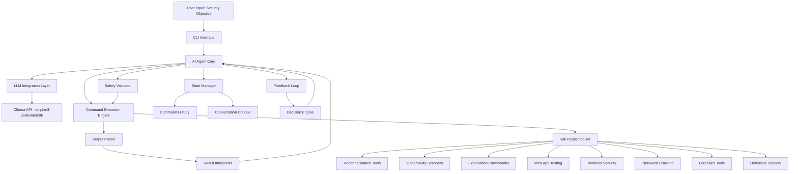

# Kali AI Command Chaining System - Architecture Design

## System Overview

An autonomous AI-powered command chaining system that integrates with the `huihui_ai/dolphin3-abliterated:8b` language model to execute penetration testing and security assessment workflows on Kali Linux.

## High-Level Architecture



## Core Components

### 1. CLI Interface Layer
**Purpose**: User interaction and real-time monitoring

**Components**:
- Main CLI controller using Rich library for formatting
- Real-time progress display with live updates
- Command history viewer
- Interactive approval prompts for high-risk operations
- Session management and logging display

**Key Features**:
- Color-coded output (info, success, warning, error)
- Progress bars for long-running operations
- Tabular display of discovered vulnerabilities
- Live command execution streaming
- Session save/resume functionality

### 2. AI Agent Core
**Purpose**: Central orchestration and decision-making

**Components**:
- Objective parser and goal decomposition
- Task planning and strategy formulation
- Command chain orchestrator
- Progress tracking and objective assessment
- Adaptive strategy adjustment

**Responsibilities**:
- Parse high-level security objectives
- Maintain conversation state with LLM
- Coordinate between all system components
- Make decisions on next actions based on results
- Assess objective completion status

### 3. LLM Integration Layer
**Purpose**: Communication with dolphin3-abliterated model

**Components**:
- Ollama client wrapper
- Prompt engineering templates
- Context window management
- Response parsing and validation
- Connection pooling and retry logic

**Configuration Support**:
- Local Ollama server (default)
- Remote Ollama server via IP address
- Custom API endpoints
- Model parameters (temperature, top_p, etc.)

**Prompt Structure**:
```
System Context:
- Role: Expert penetration tester
- Available tools: [Kali Purple toolset]
- Current objective: [User's security goal]
- Safety constraints: [Approved operations]

Conversation History:
- Previous commands executed
- All outputs received
- Discovered information
- Current progress

Current State:
- Last command: [command]
- Output: [parsed output]
- Discovered: [vulnerabilities, services, etc.]

Task:
Generate the next optimal command to progress toward the objective.
Consider the current state and previous results.
Provide reasoning for your choice.
```

### 4. Command Execution Engine
**Purpose**: Safe and controlled command execution

**Components**:
- Subprocess manager with timeout controls
- Output streaming and buffering
- Error capture and handling
- Resource monitoring (CPU, memory, network)
- Concurrent execution support for parallel scans

**Features**:
- Real-time output streaming to CLI
- Command timeout enforcement
- Process cleanup on interruption
- Environment variable management
- Working directory control

### 5. Output Parser & Result Interpreter
**Purpose**: Extract meaningful information from command outputs

**Components**:
- Tool-specific output parsers
- Regex pattern matching engine
- Structured data extraction
- Error message interpretation
- Success/failure detection

**Parsing Capabilities**:
- Nmap XML/JSON output parsing
- Metasploit console output interpretation
- Vulnerability scanner report parsing
- Network traffic analysis results
- Log file analysis
- Error message categorization

**Extracted Information**:
- Open ports and services
- Discovered vulnerabilities (CVE IDs, severity)
- Successful exploits
- Credentials found
- Network topology
- System information
- Error conditions and failures

### 6. Safety Validator & Command Classifier
**Purpose**: Prevent destructive operations and enforce safety policies

**Command Categories**:

**Auto-Execute (Safe Reconnaissance)**:
- Network scanning (nmap, masscan)
- Service enumeration
- DNS queries
- WHOIS lookups
- Passive information gathering
- Port scanning
- Banner grabbing
- SSL/TLS analysis
- Web crawling (non-invasive)

**Require Approval (Exploitation/Modification)**:
- Exploitation attempts (Metasploit, exploit-db)
- Password cracking operations
- Brute force attacks
- SQL injection attempts
- XSS/CSRF testing
- File uploads
- Command injection
- Privilege escalation attempts
- System modifications
- Database operations
- Wireless attacks (deauth, injection)

**Blacklisted (Never Execute)**:
- System shutdown/reboot commands
- Disk formatting operations
- Recursive file deletion (rm -rf /)
- Kernel module loading
- Firewall rule deletion
- Network interface destruction
- Critical service termination

**Validation Checks**:
- Command syntax validation
- Target IP/domain validation
- Parameter sanitization
- Rate limiting enforcement
- Scope verification (authorized targets only)

### 7. State Manager
**Purpose**: Maintain system state and conversation context

**State Components**:
- Original security objective
- Current goal and sub-goals
- Complete command history with timestamps
- All command outputs and parsed results
- Discovered assets and vulnerabilities
- Current progress metrics
- Strategy adjustments made
- Backtrack points for alternative approaches

**Persistence**:
- JSON-based state files
- Session recovery capability
- Export to standard formats (JSON, CSV, HTML reports)

### 8. Kali Purple Toolset Integration
**Purpose**: Comprehensive security tool support

**Tool Categories**:

**Reconnaissance Tools**:
- nmap: Network scanning and service detection
- masscan: High-speed port scanning
- netdiscover: Network discovery
- dnsenum: DNS enumeration
- fierce: DNS reconnaissance
- theHarvester: OSINT gathering
- recon-ng: Reconnaissance framework
- maltego: Link analysis and data mining

**Vulnerability Scanners**:
- OpenVAS: Comprehensive vulnerability scanning
- Nessus: Professional vulnerability assessment
- Nikto: Web server scanner
- wpscan: WordPress security scanner
- joomscan: Joomla vulnerability scanner
- OWASP ZAP: Web application security scanner

**Exploitation Frameworks**:
- Metasploit Framework: Exploitation and post-exploitation
- exploit-db: Exploit database integration
- searchsploit: Local exploit search
- BeEF: Browser exploitation framework

**Web Application Testing**:
- Burp Suite: Web vulnerability scanner
- sqlmap: SQL injection automation
- XSSer: Cross-site scripting framework
- commix: Command injection exploiter
- wfuzz: Web application fuzzer
- dirb/dirbuster: Directory brute forcing
- gobuster: URI/DNS brute forcing

**Wireless Security**:
- aircrack-ng: WiFi security auditing
- reaver: WPS attack tool
- wifite: Automated wireless attack tool
- kismet: Wireless network detector
- fern-wifi-cracker: WiFi security auditing

**Password Cracking**:
- hashcat: Advanced password recovery
- John the Ripper: Password cracking
- hydra: Network login cracker
- medusa: Parallel brute force tool
- crunch: Wordlist generator
- cewl: Custom wordlist generator

**Forensics Tools**:
- autopsy: Digital forensics platform
- volatility: Memory forensics framework
- binwalk: Firmware analysis
- foremost: File carving
- scalpel: File recovery

**Defensive Security**:
- Suricata: IDS/IPS engine
- Snort: Network intrusion detection
- OSSEC: Host-based intrusion detection
- Wazuh: Security monitoring platform
- Zeek (Bro): Network analysis framework

### 9. AI Decision Engine
**Purpose**: Intelligent next-step determination

**Decision Factors**:
- Current objective progress
- Previous command results
- Discovered vulnerabilities
- Failed attempts and errors
- Time and resource constraints
- Risk assessment
- Alternative approaches available

**Decision Logic**:
1. Analyze current state and objective
2. Evaluate progress toward goal
3. Consider discovered information
4. Assess available next steps
5. Rank options by likelihood of success
6. Select optimal command with reasoning
7. Generate command with appropriate parameters

**Strategy Patterns**:
- Sequential scanning (broad to narrow)
- Vulnerability-driven exploitation
- Service-specific testing
- Credential-based pivoting
- Network traversal
- Privilege escalation chains

### 10. Feedback Loop & Objective Assessment
**Purpose**: Continuous evaluation and strategy adjustment

**Assessment Criteria**:
- Objective completion percentage
- Discovered vulnerabilities count
- Successful exploits
- Access level achieved
- Information gathered
- Time elapsed
- Resources consumed

**Feedback Mechanisms**:
- Success/failure analysis
- Error pattern recognition
- Dead-end detection
- Alternative path identification
- Strategy effectiveness scoring

**Adaptive Behaviors**:
- Backtrack on repeated failures
- Pivot to alternative approaches
- Escalate or de-escalate techniques
- Adjust scan intensity
- Modify exploitation strategies

## Data Flow

### Command Execution Flow
```
1. User provides security objective
2. AI Agent parses objective and creates initial plan
3. Agent queries LLM for first command
4. LLM generates command with reasoning
5. Safety Validator checks command category
6. If high-risk: Request user approval
7. Command Executor runs command
8. Output Parser extracts structured data
9. Result Interpreter analyzes findings
10. State Manager updates context
11. Agent queries LLM for next command (with full context)
12. Repeat steps 4-11 until objective achieved or user stops
```

### Context Management Flow
```
Initial Context:
- Security objective
- Target information
- Constraints and scope

Growing Context (per iteration):
- Command executed
- Raw output
- Parsed results
- Discovered assets
- Vulnerabilities found
- Errors encountered
- Progress assessment

LLM receives full context for each decision
```

## Safety Architecture

### Multi-Layer Safety System

**Layer 1: Pre-Execution Validation**
- Command syntax checking
- Parameter validation
- Target scope verification
- Blacklist checking

**Layer 2: Classification-Based Control**
- Auto-execute safe commands
- Prompt for high-risk commands
- Block destructive commands

**Layer 3: Runtime Monitoring**
- Resource usage limits
- Timeout enforcement
- Output size limits
- Network traffic monitoring

**Layer 4: Post-Execution Review**
- Error analysis
- Impact assessment
- Rollback capability (where applicable)

**Layer 5: Audit Trail**
- Complete command logging
- Timestamp tracking
- User approval records
- Result documentation

## Configuration System

### Configuration File Structure
```yaml
# config.yaml

llm:
  provider: ollama
  model: huihui_ai/dolphin3-abliterated:8b
  server:
    host: localhost  # or remote IP
    port: 11434
  parameters:
    temperature: 0.7
    top_p: 0.9
    max_tokens: 2048

safety:
  mode: semi-autonomous
  require_approval:
    - exploitation
    - password_cracking
    - brute_force
    - system_modification
  blacklist:
    - rm -rf
    - mkfs
    - dd if=/dev/zero
    - shutdown
    - reboot
  rate_limits:
    commands_per_minute: 10
    max_concurrent: 3

execution:
  timeout:
    default: 300
    scanning: 1800
    exploitation: 600
  output:
    max_size_mb: 100
    stream: true
  
logging:
  level: INFO
  file: logs/kali-ai-agent.log
  format: json
  rotation: daily

tools:
  paths:
    nmap: /usr/bin/nmap
    metasploit: /usr/bin/msfconsole
    sqlmap: /usr/bin/sqlmap
  # ... other tool paths

targets:
  allowed_networks:
    - 192.168.1.0/24
    - 10.0.0.0/8
  excluded_ips:
    - 192.168.1.1  # gateway
```

## Error Handling Strategy

### Error Categories

**1. Command Execution Errors**
- Syntax errors: Retry with corrected syntax
- Tool not found: Suggest installation or alternative
- Permission denied: Suggest privilege escalation or alternative approach
- Timeout: Adjust parameters or split into smaller tasks

**2. Network Errors**
- Connection refused: Target may be down or filtered
- Timeout: Adjust timing parameters
- DNS resolution failure: Try alternative resolution methods

**3. LLM Communication Errors**
- Connection failure: Retry with exponential backoff
- Invalid response: Re-prompt with clarification
- Context overflow: Summarize and compress context

**4. Parsing Errors**
- Unexpected output format: Use generic parser
- Incomplete output: Request re-execution
- Corrupted data: Log and skip

### Recovery Mechanisms
- Automatic retry with backoff
- Alternative command suggestion
- Strategy pivot
- User notification and manual intervention option
- Graceful degradation

## Performance Considerations

### Optimization Strategies
- Parallel execution of independent scans
- Output streaming for large results
- Context compression for long sessions
- Caching of tool availability checks
- Connection pooling for LLM API

### Resource Management
- Memory limits for output buffering
- CPU throttling for intensive operations
- Network bandwidth monitoring
- Disk space checks for logs and reports

## Security Considerations

### System Security
- Run with minimal required privileges
- Sandboxed execution environment (optional)
- Encrypted storage for sensitive data
- Secure credential handling
- API key protection

### Target Security
- Scope enforcement (authorized targets only)
- Rate limiting to avoid DoS
- Respectful scanning (timing, intensity)
- Compliance with rules of engagement

## Extensibility

### Plugin Architecture
- Custom tool integrations
- Additional LLM providers
- Custom parsers for new tools
- Strategy modules
- Report generators

### API Design
- RESTful API for future web interface
- WebSocket support for real-time updates
- Event-driven architecture for extensibility

## Project Structure

```
kali-ai-agent/
├── install.sh                 # Installation script
├── requirements.txt           # Python dependencies
├── config.yaml               # Configuration file
├── README.md                 # User documentation
├── ARCHITECTURE.md           # This file
├── LICENSE                   # License information
│
├── src/
│   ├── __init__.py
│   ├── main.py              # Entry point
│   │
│   ├── cli/
│   │   ├── __init__.py
│   │   ├── interface.py     # CLI controller
│   │   ├── display.py       # Rich formatting
│   │   └── prompts.py       # User interaction
│   │
│   ├── core/
│   │   ├── __init__.py
│   │   ├── agent.py         # AI Agent Core
│   │   ├── state.py         # State Manager
│   │   └── decision.py      # Decision Engine
│   │
│   ├── llm/
│   │   ├── __init__.py
│   │   ├── client.py        # Ollama client
│   │   ├── prompts.py       # Prompt templates
│   │   └── context.py       # Context management
│   │
│   ├── execution/
│   │   ├── __init__.py
│   │   ├── executor.py      # Command executor
│   │   ├── parser.py        # Output parser
│   │   └── interpreter.py   # Result interpreter
│   │
│   ├── safety/
│   │   ├── __init__.py
│   │   ├── validator.py     # Safety validator
│   │   ├── classifier.py    # Command classifier
│   │   └── rules.py         # Safety rules
│   │
│   ├── tools/
│   │   ├── __init__.py
│   │   ├── base.py          # Base tool interface
│   │   ├── reconnaissance.py
│   │   ├── vulnerability.py
│   │   ├── exploitation.py
│   │   ├── webapp.py
│   │   ├── wireless.py
│   │   ├── password.py
│   │   ├── forensics.py
│   │   └── defensive.py
│   │
│   ├── feedback/
│   │   ├── __init__.py
│   │   ├── assessor.py      # Objective assessment
│   │   └── strategy.py      # Strategy adjustment
│   │
│   └── utils/
│       ├── __init__.py
│       ├── config.py         # Configuration loader
│       ├── logger.py         # Logging utilities
│       └── helpers.py        # Helper functions
│
├── tests/
│   ├── __init__.py
│   ├── test_agent.py
│   ├── test_executor.py
│   ├── test_parser.py
│   ├── test_safety.py
│   └── test_integration.py
│
├── examples/
│   ├── objectives/
│   │   ├── network_scan.txt
│   │   ├── web_assessment.txt
│   │   ├── wireless_audit.txt
│   │   └── full_pentest.txt
│   └── workflows/
│       ├── reconnaissance.md
│       ├── exploitation.md
│       └── post_exploitation.md
│
├── docs/
│   ├── installation.md
│   ├── usage.md
│   ├── configuration.md
│   ├── safety.md
│   └── examples.md
│
└── logs/                     # Runtime logs (created)
    └── sessions/             # Session logs
```

## Implementation Phases

### Phase 1: Core Infrastructure
- Project structure setup
- Configuration system
- CLI interface foundation
- Logging system

### Phase 2: LLM Integration
- Ollama client implementation
- Prompt engineering
- Context management
- Response parsing

### Phase 3: Command Execution
- Subprocess management
- Output streaming
- Error handling
- Timeout controls

### Phase 4: Safety System
- Command classification
- Validation rules
- Approval workflow
- Blacklist enforcement

### Phase 5: Tool Integration
- Base tool interface
- Reconnaissance tools
- Vulnerability scanners
- Basic parsing

### Phase 6: Intelligence Layer
- Output interpretation
- Decision engine
- Feedback loop
- Strategy adjustment

### Phase 7: Advanced Tools
- Exploitation frameworks
- Web application testing
- Wireless security
- Password cracking
- Forensics
- Defensive tools

### Phase 8: Polish & Testing
- Comprehensive testing
- Documentation
- Example workflows
- Installation automation

## Success Metrics

### System Performance
- Command execution latency < 2s overhead
- LLM response time < 5s average
- Context management efficiency
- Memory usage optimization

### AI Effectiveness
- Objective completion rate
- Command success rate
- Strategy adaptation effectiveness
- Error recovery success

### Safety Compliance
- Zero unauthorized command executions
- 100% approval workflow compliance
- Complete audit trail
- No false negatives in blacklist

## Future Enhancements

### Potential Features
- Multi-target parallel operations
- Collaborative multi-agent workflows
- Advanced reporting and visualization
- Integration with vulnerability databases
- Automated report generation
- Machine learning for pattern recognition
- Custom tool development framework
- Cloud-based execution support
- Team collaboration features
- Compliance framework integration