# Kali AI Command Chaining System - System Diagrams

This document contains visual representations of the system architecture, workflows, and data flows.

## System Architecture Diagram

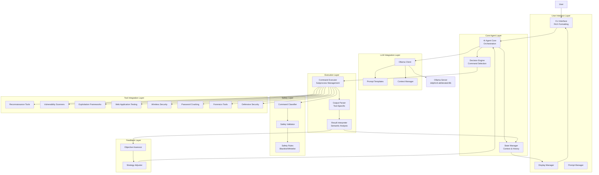

## Command Execution Flow

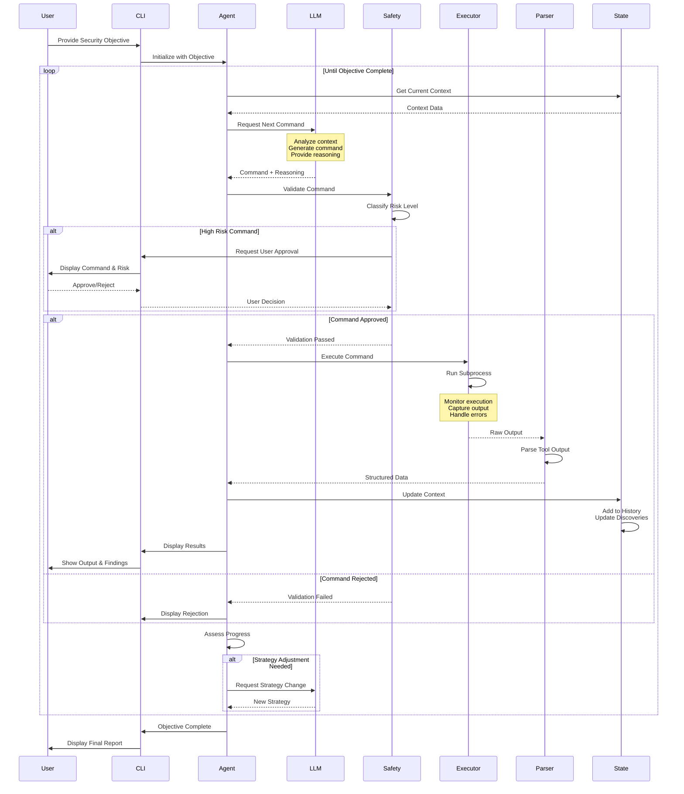

## Safety Validation Flow

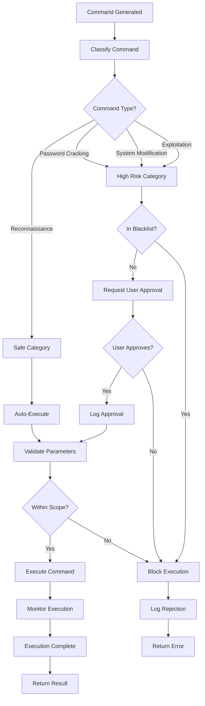

## AI Decision Making Process

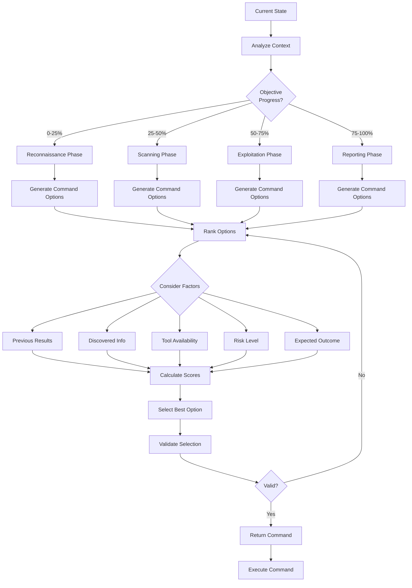

## State Management Flow

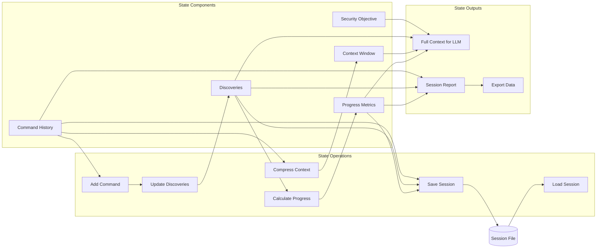

## Tool Integration Architecture

```mermaid
graph TB
    subgraph "Base Tool Interface"
        BaseTool[Base Tool Class]
        Execute[execute method]
        Parse[parse method]
        Validate[validate method]
    end
    
    subgraph "Reconnaissance Tools"
        Nmap[Nmap Tool]
        Masscan[Masscan Tool]
        DNSEnum[DNS Enum Tool]
    end
    
    subgraph "Vulnerability Tools"
        OpenVAS[OpenVAS Tool]
        Nikto[Nikto Tool]
        ZAP[OWASP ZAP Tool]
    end
    
    subgraph "Exploitation Tools"
        MSF[Metasploit Tool]
        ExploitDB[Exploit-DB Tool]
        SearchSploit[SearchSploit Tool]
    end
    
    subgraph "Web Testing Tools"
        SQLMap[SQLMap Tool]
        Burp[Burp Suite Tool]
        XSSer[XSSer Tool]
    end
    
    BaseTool --> Execute
    BaseTool --> Parse
    BaseTool --> Validate
    
    BaseTool -.inherits.-> Nmap
    BaseTool -.inherits.-> Masscan
    BaseTool -.inherits.-> DNSEnum
    BaseTool -.inherits.-> OpenVAS
    BaseTool -.inherits.-> Nikto
    BaseTool -.inherits.-> ZAP
    BaseTool -.inherits.-> MSF
    BaseTool -.inherits.-> ExploitDB
    BaseTool -.inherits.-> SearchSploit
    BaseTool -.inherits.-> SQLMap
    BaseTool -.inherits.-> Burp
    BaseTool -.inherits.-> XSSer
    
    Executor[Command Executor] --> BaseTool
```

## Context Window Management

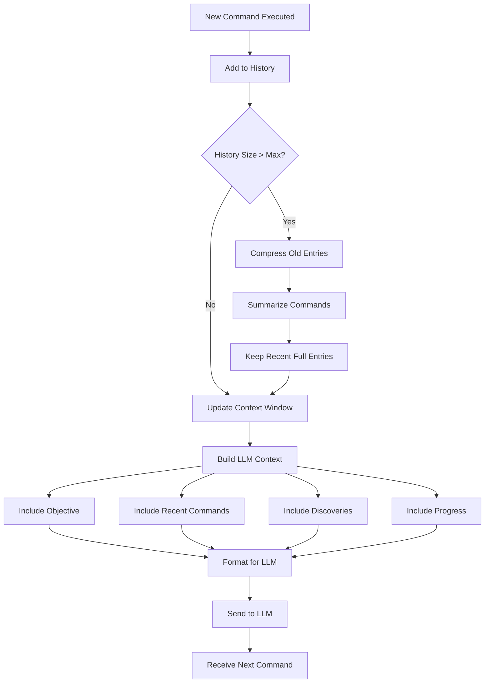

## Feedback Loop and Strategy Adjustment

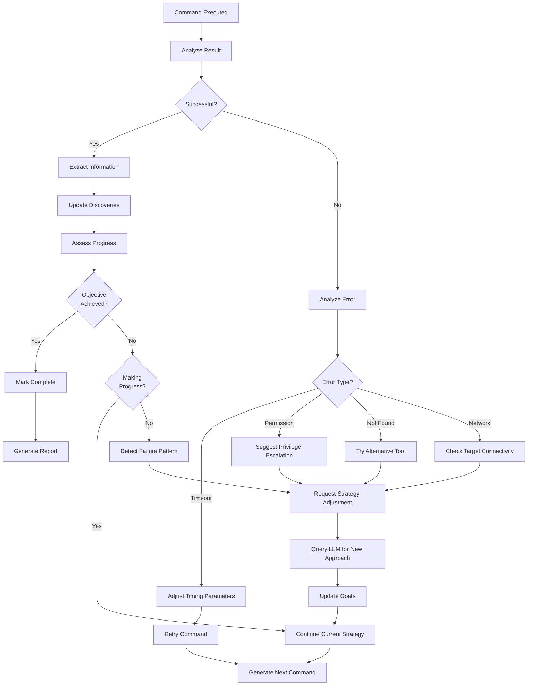

## Session Lifecycle

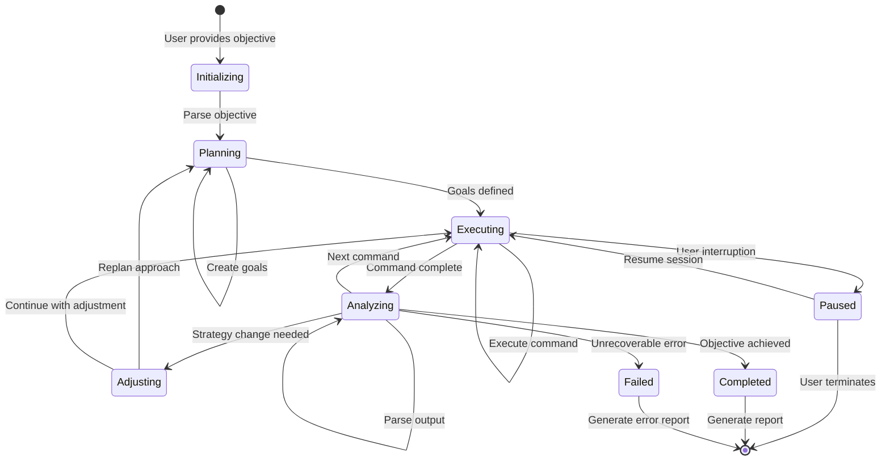

## Data Flow Through System

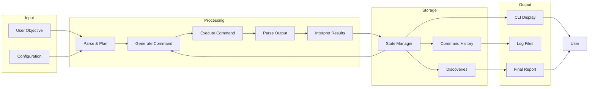

## Error Handling Flow

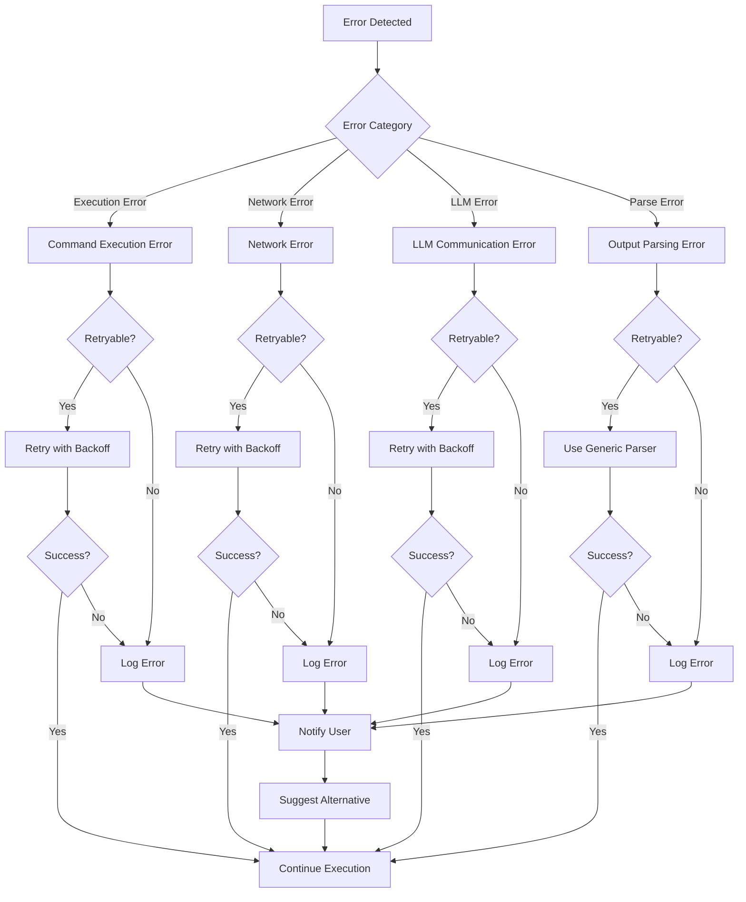

## Deployment Architecture

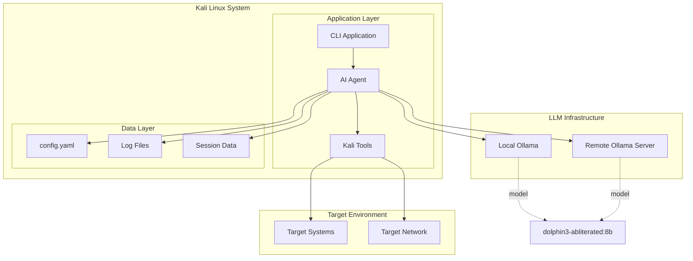

---

These diagrams provide a comprehensive visual understanding of the system's architecture, workflows, and data flows. They can be used for:

- System design discussions
- Implementation guidance
- Documentation
- Training materials
- Troubleshooting
- Architecture reviews